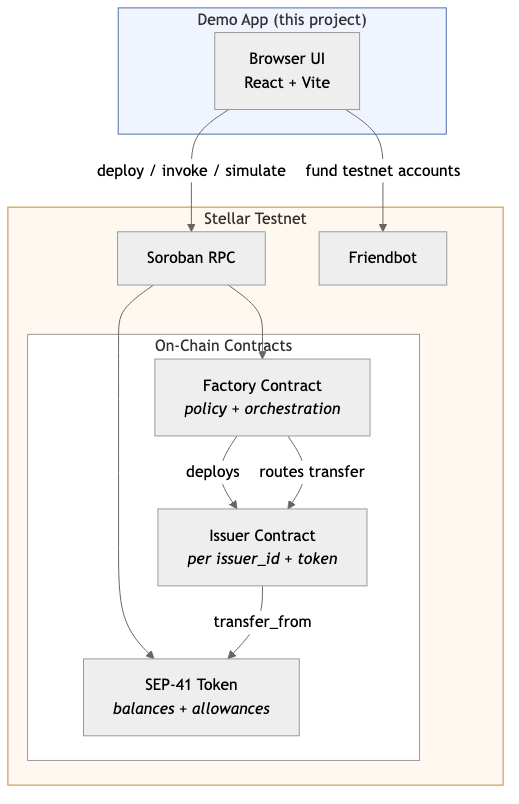
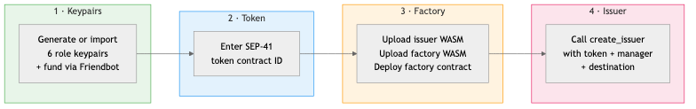
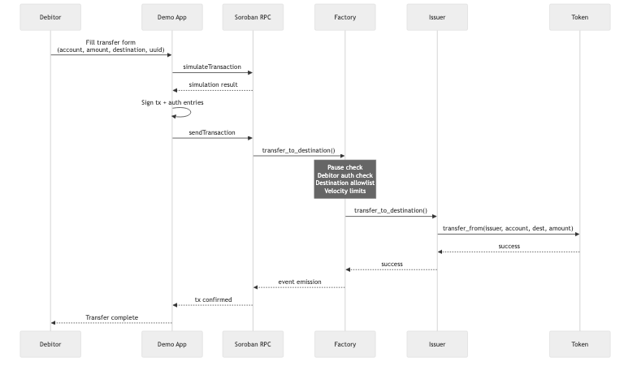

# Debit Card Reference — Testnet Demo

Interactive demo for the [Stellar Soroban debit card reference contracts](../README.md).
Deploy the factory and issuer contracts to testnet, configure roles and velocity
limits, approve token spending, and execute card-style transfers — all from
the browser.

> **This is a reference implementation for learning and prototyping.**
> It has not been audited. Use at your own risk.



## Prerequisites

| Requirement | Version |
|---|---|
| [Node.js](https://nodejs.org/) | >= 22 |
| [pnpm](https://pnpm.io/) | >= 10 |

You also need compiled WASM artifacts for the **issuer** and **factory** contracts.
Build them from the repository root:

```bash
cd contracts
make build                       # builds issuer WASM
cd factory && make build && cd .. # builds factory WASM
```

The resulting `.wasm` files are in each crate's
`target/wasm32v1-none/release/` directory.

## Quickstart

```bash
# Install dependencies
pnpm install

# Start the dev server (http://localhost:3000)
pnpm dev
```

The app connects to **Stellar Testnet** (`soroban-testnet.stellar.org`) by default.
No environment variables are required for basic usage.

## How It Works

The demo walks through the full lifecycle of the debit card contract system
across six tabs, each mapping to a contract role.

### Setup Flow



| Step | What happens |
|---|---|
| **1. Keypairs** | Generate or import Stellar keypairs for each role (owner, pauser, manager, debitor, cardholder, destination). Fund them with testnet XLM via Friendbot. |
| **2. Token** | Enter a SEP-41 token contract ID. The default testnet XLM SAC address is shown as a placeholder. |
| **3. Factory** | Upload the compiled issuer and factory WASM files, then deploy the factory contract with the owner, pauser, and issuer WASM hash as constructor args. Alternatively, connect to an existing factory by address. |
| **4. Issuer** | Call `create_issuer` on the factory to deploy an issuer contract for a given `(issuer_id, token)` pair with a manager and destination. |

### Role Tabs

Once setup is complete, the remaining tabs unlock based on which keypairs and
contracts are configured:

- **Manager** — Authorize debitor accounts (`update_authorized_debitor`) and set
  per-cardholder velocity limits (`update_user_velocity`): period duration,
  period spend cap, and per-transaction cap.
- **Cardholder** — Approve the issuer contract to spend tokens from the
  cardholder wallet (`token.approve`). View current balance and allowance.
- **Debitor** — Execute a card payment by calling `transfer_to_destination` with
  a cardholder account, amount, destination, and unique transaction UUID.
- **Pauser** — Pause or unpause the factory contract. Pausing blocks all
  state-changing operations except `unpause`.
- **Inspector** — Read-only queries: pause status, issuer address lookup,
  authorization checks, velocity state, and token balances.

### Transfer Flow

When a debitor submits a transfer, this is what happens end-to-end:



The factory enforces all policy checks (pause guard, debitor authorization,
destination allowlist, velocity limits) before routing the call to the issuer
contract, which performs the actual `transfer_from` on the token.

## Request Log

The right sidebar shows a live log of every Soroban RPC call the app makes.
Each entry includes the method name, a summary of the request and response,
duration, and success/error status. This is useful for understanding the
on-chain interaction pattern and debugging failed transactions.

## Project Structure

```
src/
├── main.tsx                         # React entry point, Buffer polyfill
├── App.tsx                          # Root layout, React Query + state providers
├── store.ts                         # Reducer, context, actions, hooks
├── types.ts                         # Shared type definitions
│
├── soroban/                         # Stellar / Soroban integration
│   ├── client.ts                    # RPC server setup with logging proxy
│   ├── keypairs.ts                  # Keypair generation, import, Friendbot funding
│   ├── codec.ts                     # JS values <-> Soroban ScVal encoding
│   ├── deploy.ts                    # WASM upload + contract deployment
│   ├── factory.ts                   # Factory contract method wrappers
│   └── token.ts                     # SEP-41 token wrappers (approve, balance, allowance)
│
├── helper/
│   ├── soroban.ts                   # invokeContract() and simulateContract() primitives
│   └── validation.ts                # Address / key validation
│
├── page/                            # One page per role tab
│   ├── Setup.tsx                    # 4-step initialization wizard
│   ├── Manager.tsx                  # Debitor auth + velocity config
│   ├── Cardholder.tsx               # Token approval + balance display
│   ├── Debitor.tsx                  # Transfer execution
│   ├── Pauser.tsx                   # Pause / unpause
│   └── Inspector.tsx                # Read-only state queries
│
├── component/                       # Reusable UI components
│   ├── Header.tsx                   # App header with network indicator
│   ├── StatusBar.tsx                # Connected-contract status display
│   ├── TabBar/                      # Navigation tabs (role-based enabling)
│   ├── KeypairCard/                 # Keypair generate / import / fund card
│   ├── LogPane/                     # RPC request/response log sidebar
│   └── NetworkIndicator/            # Testnet connection badge
│
└── style/                           # Global SCSS
    ├── global.scss
    └── utils.scss
```

## Available Scripts

| Command | Description |
|---|---|
| `pnpm dev` | Start Vite dev server on port 3000 |
| `pnpm build` | TypeScript check + production build |
| `pnpm preview` | Serve the production build locally |
| `pnpm lint` | Run ESLint |
| `pnpm lint:ts` | Type-check without emitting |

## Tech Stack

- **React 19** with TypeScript — UI framework
- **Vite 7** with SWC — build tooling and HMR
- **@stellar/stellar-sdk 14** — Soroban RPC client, transaction building, keypair management
- **@stellar/design-system** — Stellar-branded UI components
- **@tanstack/react-query** — async state management for RPC calls
- **SCSS** — component-scoped styling

## Configuration

| Environment Variable | Default | Description |
|---|---|---|
| `VITE_BASE_PATH` | `/` | Base path for the built app (useful for GitHub Pages deployment) |

The RPC URL and network passphrase are set in `src/soroban/client.ts` and
point to Stellar Testnet. To target a different network, update the constants
in that file.

## License

Apache-2.0 — see [LICENSE](LICENSE).
